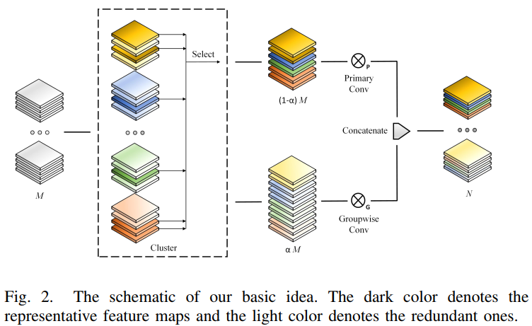
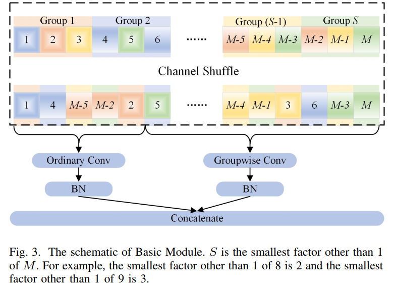
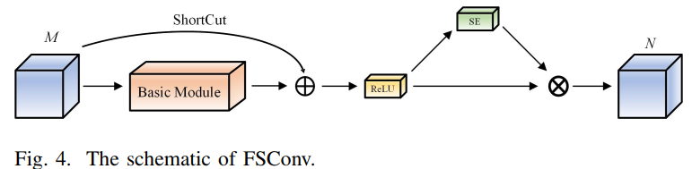
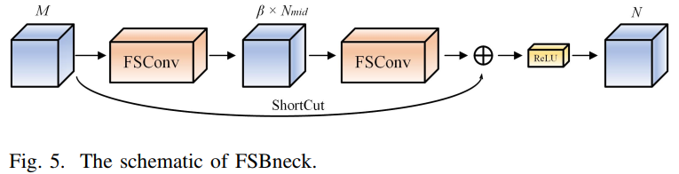
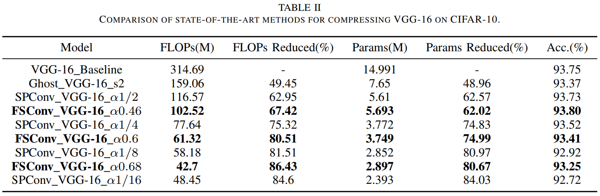
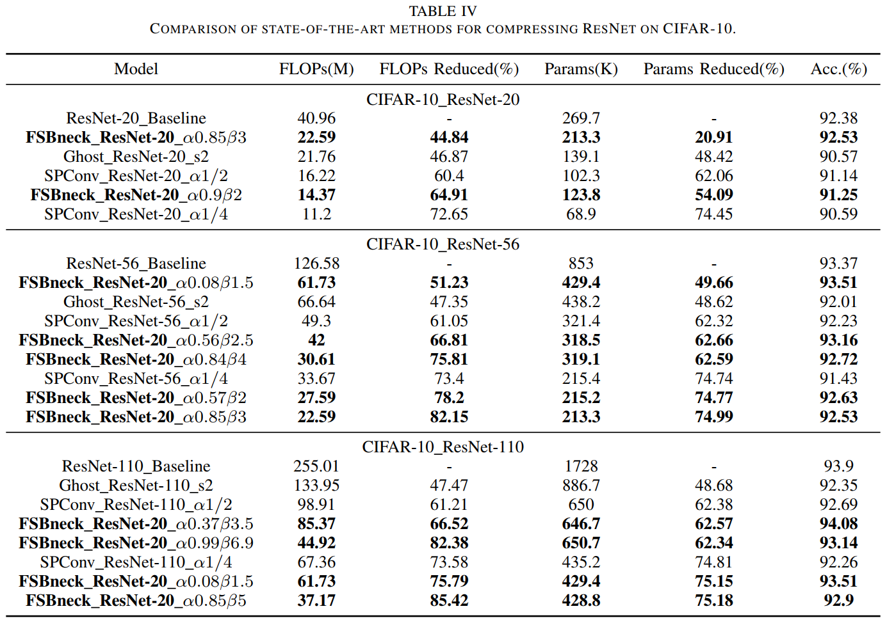
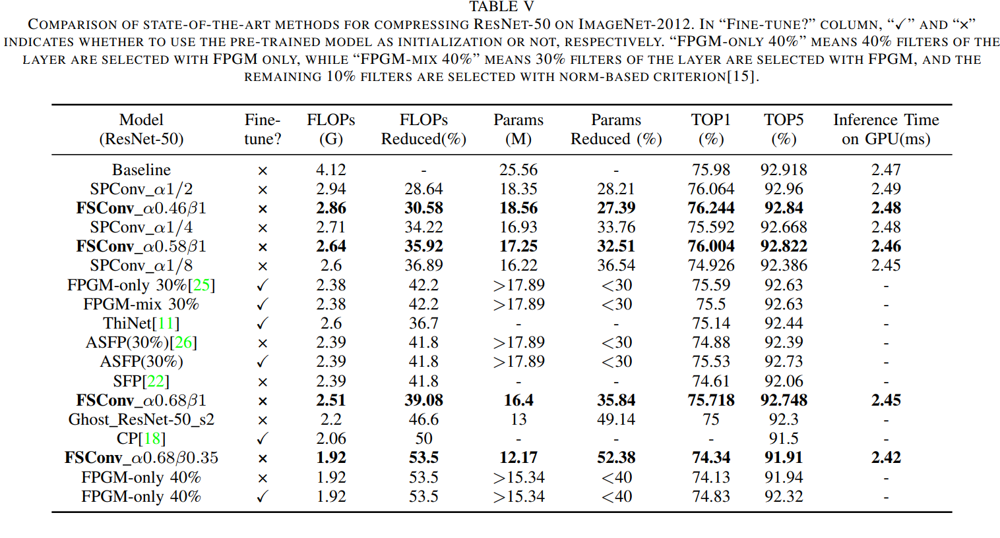
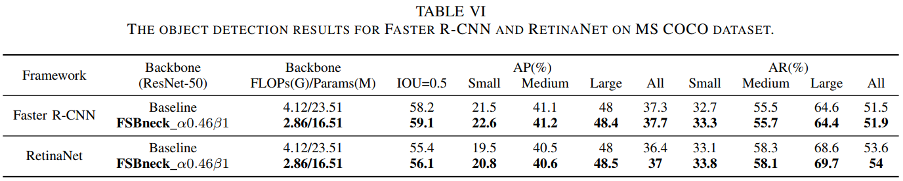

# Flexible-and-separable-convolution-for-a-better-faster-and-lighter-architecture

## FSConv Code
This repo provides pretrained models and inference code for PyTorch.

## Desription

### Approach

### Performance

